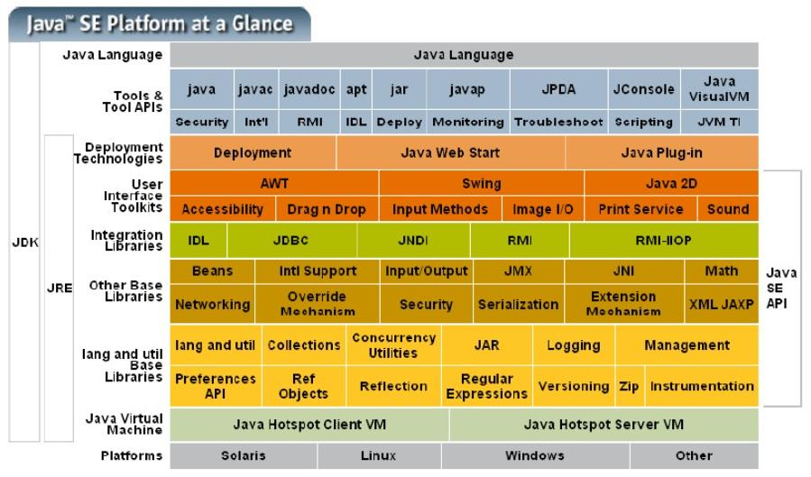

一、三大版本

1. JavaSE：标准版（桌面程序，控制台）
2. JavaME：嵌入式开发
3. JavaEE：E企业级开发（Web端，服务器开发）

二、JDK、JRE、JVM

1. JDK: Java Development Kit -开发者包，包含整个Java
2. JRE: Java Runtime Enviroment -只提供运行环境，但不能开发
3. JVM: JAVA Virtual Machine -Java虚拟机，java可以开发一次，在所有安装Java的平台都能使用的核心，Java程序是在Java虚拟机中运行的。

