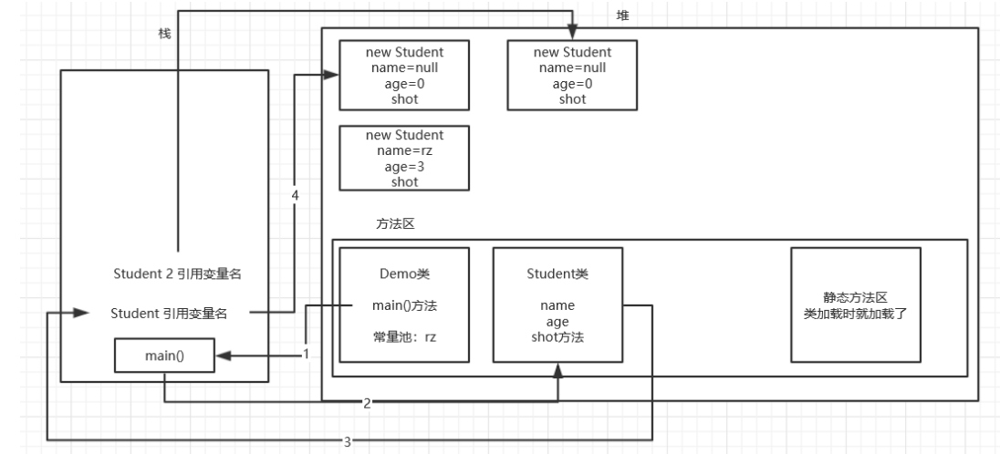

针对以下这个Demo类的主方法的执行，运行流程和内存如图：

```java
package com.rzp.oop;

public class Student {
    String name;
    int age;
    public void shot(){
        System.out.println("作业没带");
    }
}


package com.rzp.oop;

public class Demo2 {
    public static void main(String[] args) {
        Student student = new Student();
        student.name = "rz";
        student.age = 3;
        student.shot();

        System.out.println(student.name);
        System.out.println(student.age);
    }
}

```

1. 方法区加载Demo类
2. 执行main方法，在栈中创建，试图调用Student构造器
3. 方法区加载Student类,调用Student类的构造器
4. 在栈中创建Student的引用对象（相当于一个名字）
5. 在堆中创建Student对象
1)