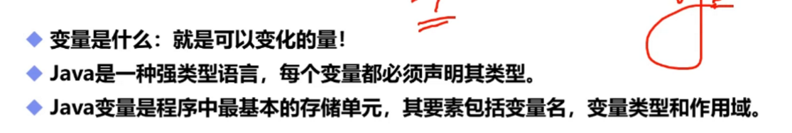
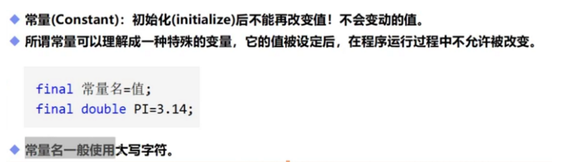

### 变量



### 变量作用域
1. 类变量
2. 实例变量
3. 局部变量

```java
public class Demo08{
    
    //类变量：从属于类
    static double salary = 2500;
    
    
    //实例变量：从属于对象，相当于赋予该类的对象一个属性。
    //可以不初始化，如果没初始化则是默认值
    //除了基本类型，默认值都是null
    String name;
    int age;
    
    
    //main方法
    public static void main (String[] args){
        //局部变量：仅限于方法中使用的变量
        //必须声明和初始化
        int i = 10;
    }
}
```


### 常量


```java
public class Demo08{
    
    //static 和 final都是修饰符，不存在先后
    static final double PI = 2500;
    final static double PI = 2500;
    
    public static void main (String[] args){
        System.out.println(PI);
        
    }
}
```

## 变量命名规范

定义：驼峰，命名中第二个以后的首字母大写。

1. 看到名字就知道意思。
2. 变量和方法名：首字母小写，驼峰：monthSalary
3. 常量：大写字母和下划线：MAX_VALUE
4. 类名：首字母大写，驼峰：GoodMan
